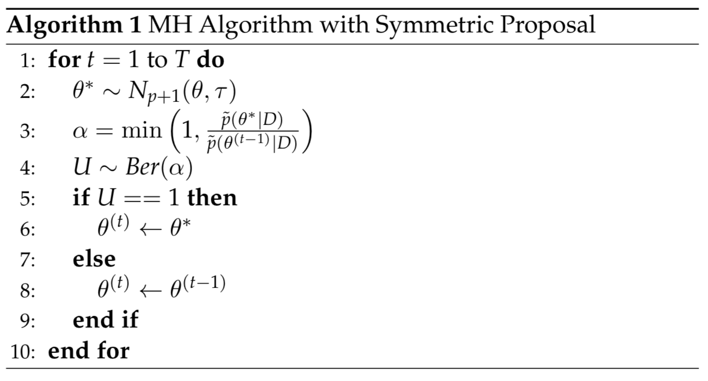

```{r setup, include=FALSE}
options(htmltools.dir.version = FALSE)
knitr::opts_chunk$set(echo=FALSE, warning=FALSE, message=FALSE)
library(RefManageR)
library(kableExtra)
library(dplyr)
library(mixtools)
library(mvtnorm)


#BibOptions(check.entries = FALSE, bib.style = "numeric", style = "markdown",
#           dashed = TRUE)
#file.name <- system.file("Bib", "biblatexExamples.bib", package = "RefManageR")
#bib <- ReadBib("bibliography.bib")
```

```{r, echo=FALSE, warning=FALSE, include=FALSE}
inline <- function(x = "") paste0("`` `r ", x, "` ``")

knitr::opts_chunk$set(echo = TRUE, comment = "", fig.height = 5.5, fig.width = 5.5, cache = F)
```

## Overview of Bayesian Inference
- Parameter vector $\theta \in \mathbb{R}^p$ and data $D$.
- $\mathcal{L}(  \theta |  D) = p( D|  \theta)$ with prior $p(\theta)$ over parameters space.

$$
\begin{align}
	p(\theta | D) & = C\cdot p( D|  \theta) p( \theta) \\
					& \propto p( D|  \theta) p( \theta) \\
\end{align}
$$
- Inference engines:
  - Frequentist: **optimization methods** for maximizing $p( D| \theta)$.
  - Bayesian: **sampling methods** for drawing from $p( \theta | D)$.
    - Difficult since $C$ unknown.

---
## Gibbs Sampler for Linear Regression

- Data $D = (y_i,  x_i)_{1:n}$ and $\theta = (\beta, \phi)$, where $x_i, \beta \in \mathbb{R}^{p+1}$.
- $p( D |  \theta) = \prod_ip(y_i |  x_i,  \theta ) \stackrel{d}{=} \prod_iN(y_i\ ;\ x_i '  \beta, \phi)$.
- If we use joint prior $p(\theta) = p(\beta)p(\phi) = N_{p+1}( 0,  I)IG(\alpha, \lambda)$, then

--

  - $p(\beta | \phi, D) = N_{p+1}\Big( (I + \frac{1}{\phi} X' X )^{-1}( \frac{1}{\phi} X' y)  , (I + \frac{1}{\phi} X' X )^{-1} \Big)$.
  - $p(\phi | \beta, D) = IG(\alpha + n/2, \lambda + \frac{1}{2} ( y -  X \beta)'( y - X \beta) )$
	
--

- **Gibbs Sampling**: sample from these two conditionals in alternating fashion
  -  $\beta^{(t)} | \phi^{(t-1)} \sim N_{p+1} \Big( ( I + \frac{1}{ \phi^{(t-1)}}  X'  X )^{-1}( \frac{1}{  \phi^{(t-1)} }  X'  y)  , ( I + \frac{1}{ \phi^{(t-1)}}  X'  X )^{-1} \Big)$.
  - $\phi^{(t)} |  \beta^{(t)} \sim IG(\alpha + n/2, \lambda + \frac{1}{2} ( y -  X  \beta^{(t)})'( y -  X  \beta^{(t)} ) )$.
- Claim: The samples $\{\beta^{(t)}, \phi^{(t)} \}_{1:T}$ converge to draws from the posterior $p(\beta, \phi |  D)$.


---
## Gibbs Sampling
```{r, echo=F, warning=FALSE, message=FALSE, error=FALSE}
set.seed(111)
## simulate data
n <- 10000
X <- cbind(1, rnorm(n))
y <- X %*% matrix(c(10,10), ncol=1) + rnorm(n,0, 10)
iter <- 1000

## create shells to store Gibbs draws
phi <- numeric(length = iter)
beta <- matrix(NA, ncol=iter, nrow = ncol(X) )

## initialize
phi[1] <- 90

## pre-compute some quantities
xtx <- t(X) %*% X
xty  <- t(X) %*% y
Imat <- diag(ncol(X))
```

```{r, echo=T, warning=FALSE, message=FALSE, error=FALSE}
for( i in 2:iter){
  post_cov <- solve(Imat + (1/phi[i-1]) * xtx)
  post_mean <- post_cov %*% ((1/phi[i-1]) * t(X) %*% y)
  beta[, i]  <- MASS::mvrnorm(1, post_mean , post_cov )
  
  post_rate <- 100 + .5*sum((y - X %*% beta[, i, drop=F])^2)
  post_shape <- 5 + n/2
  phi[i] <- invgamma::rinvgamma(1, post_shape, rate = post_rate)
}
```

--

- We can plot the sequences or "chains":  $\{\beta^{(t)} \}_{1:T}$ and $\{\phi^{(t)} \}_{1:T}$.
- These are the **Monte Carlo Markov Chains**.
	- **Monte Carlo**: each element of the chain is randomly drawn/simulated.
	- **Markov**: $\theta^{(t)}$ only depends on the previous element $\theta^{(t-1)}$.

---
## Gibbs Sampling

```{r gibbs_anim, echo=F, warning=FALSE, message=FALSE, error=FALSE, cache=T, fig.show='animate', fig.width=10, interval=.25, fig.height=6, cache=FALSE, aniopts="loop", animation.hook='gifski', fig.align='center', echo=F, eval=T}

par(mfrow=c(2,3))
for( i in seq(10, 1000, 10)){
  plot(phi[1:i], type='l', xlim=c(2,1000), xlab='Iteration, t' )
  abline(h=10^2, col='red', lwd=2)
  
  plot(beta[1,2:i], type='l', xlim=c(2,1000), xlab='Iteration, t')
  abline(h=10, col='red', lwd=2)
  
  plot(beta[2,2:i], type='l', xlim=c(2,1000), xlab='Iteration, t')
  abline(h=10, col='red', lwd=2)
  
  hist(phi[2:i], xlab='Posterior Draw', main='Posterior phi' )
  abline(v=10^2, col='red', lwd=2)
  
  hist(beta[1,2:i], xlab='Posterior Draw', main='Posterior beta_1')
  abline(v=10, col='red', lwd=2)
  
  hist(beta[2,2:i], xlab='Posterior Draw', main='Posterior beta_2')
  abline(v=10, col='red', lwd=2)
}

```

---
## MCMC - Checks and Limitations of Gibbs
- After sampling, must conduct visual and formal checks for
	- Convergence.
	- Autocorrelation. 
	- Sensitivity to initial values.
- Gibbs requires known conditional posteriors: $p(\beta | \phi, D)$, $p(\phi | \beta, D)$.
- In models without conjugacy, these are unknown - all we know is the form of $p(\theta | D)$ up to a proportionality constant.

---
## Sampling for a Logistic Regression

- Data $D = (y_i, x_i)_{1:n}$, where $x_i \in \mathbb{R}^{p+1}$ and $y_i \in \{0,1\}$.	
$$p( D | \theta) \stackrel{d}{=} \prod_iBer\big( \ y_i \ ; \ expit( x_i ' \theta) \big)$$ 

$$p(\theta) \stackrel{d}{=} N_{p+1}( 0, I)$$

- Posterior is unknown:
$$p(\theta | D) \propto N_{p+1}( 0, I) \prod_iBer\big( \ y_i \ ; \ expit( x_i ' \theta) \big) $$
- Gibbs can't be used here.

---
## The Metropolis-Hastings Sampler
<small>
Along with initial value, $\theta^{(0)}$, MH algorithm requires two inputs:
- **Unnormalized target density**, $\tilde p(\theta | D)$: 
$$p(\theta | D) =C\cdot\tilde p(\theta | D) = C\cdot Ber\big( expit( x_i ' \theta) \big)  N_{p+1}( 0, I)$$
- **Jumping Distribution**: 
$$Q(\theta^* | \theta) = N_{p+1}( \theta, \tau  )$$
</small>
<center>

</center>

---
## MH for Univariate Logit Model

```{r, echo=T, eval=F}
# target log density 
p_tilde <- function(y, x, theta){
  p <- invlogit( x %*% theta)
  lik <- sum(dbinom(y, 1, p, log = T))
  pr <- sum(dnorm( theta, 0, 100, log = T))
  eval <- lik + pr
  return(eval)
}

iter <- 1000 # number of iterations
tau <- .1 # proposal sd
theta <- matrix(NA, nrow = 2, ncol = iter) # for storing draws
theta[,1] <- c(0,0) # initialize

for(i in 2:iter){
  # propose theta
  theta_star <- MASS::mvrnorm(1, theta[,i-1] , tau*diag(2) )
  
  # accept/reject
  prop_eval <- p_tilde(y, x, theta_star)
  curr_eval <- p_tilde(y, x, theta[,i-1, drop=F])
  ratio <- exp( prop_eval - curr_eval )
  U <- rbinom(n = 1, size = 1, prob = min( c(1, ratio  ) ) )
  theta[, i] <- U*theta_star + (1-U)*theta[, i-1]
}


```

---
## MH for Univariate Logit Model

```{r, echo=F}
library(LaplacesDemon)

x <- cbind(1, rnorm(1000))
y <- rbinom(1000, 1, invlogit( 1 - 1*x[,2] ) )

p_tilde <- function(y, x, theta){
  p <- invlogit( x %*% theta)
  res <- sum(dbinom(y, 1, p, log = T)) + sum(dnorm( theta, 0, 100, log = T))
  return(res)
}

iter <- 2000
tau <- .1

theta <- matrix(NA, nrow = 2, ncol = iter)
theta[,1] <- c(0,0)

theta2 <- matrix(NA, nrow = 2, ncol = iter)
theta2[,1] <- c(0,0)

theta3 <- matrix(NA, nrow = 2, ncol = iter)
theta3[,1] <- c(0,0)

```

```{r, echo=F}
library(LaplacesDemon)
par(mfrow=c(1,2))
for(i in 2:iter){
  
  theta_star <- MASS::mvrnorm(1, theta[,i-1] , .001*diag(2) )
  ratio <- exp(p_tilde(y, x, theta_star) - p_tilde(y, x, theta[,i-1, drop=F]) )
  U <- rbinom(n = 1, size = 1, prob = min( c(1, ratio  ) ) )
  theta[, i] <- U*theta_star + (1-U)*theta[, i-1]

  theta_star <- MASS::mvrnorm(1, theta2[,i-1] , .05*diag(2) )
  ratio <- exp(p_tilde(y, x, theta_star) - p_tilde(y, x, theta2[,i-1, drop=F]) )
  U <- rbinom(n = 1, size = 1, prob = min( c(1, ratio  ) ) )
  theta2[, i] <- U*theta_star + (1-U)*theta2[, i-1]
  
  theta_star <- MASS::mvrnorm(1, theta3[,i-1] , 1*diag(2) )
  ratio <- exp(p_tilde(y, x, theta_star) - p_tilde(y, x, theta3[,i-1, drop=F]) )
  U <- rbinom(n = 1, size = 1, prob = min( c(1, ratio  ) ) )
  theta3[, i] <- U*theta_star + (1-U)*theta3[, i-1]

}
```

```{r, echo=F}
z <- matrix(nrow=100, ncol=100)
mu = rowMeans(theta)
sigma = cov( t(theta))

x.points <- quantile(theta[1,],probs=seq(.01,1,.01))
y.points <- quantile(theta[2,],probs=seq(.01,1,.01))

for (i in 1:100) {
  for (j in 1:100) {
    z[i,j] <- mvtnorm::dmvnorm(c(x.points[i],y.points[j]), mean=mu,sigma=sigma)
  }
}

```

```{r sampleani, cache=T, fig.show='animate', fig.width=10,interval=.25, fig.height=7.5, cache=FALSE, aniopts="loop", animation.hook='gifski', fig.align='center', echo=F, eval=T}

for(i in seq(10, 2000, 10)){
  par(mfrow=c(2,3))
  
  plot(theta[1,2:i], theta[2,2:i], type='l', xlim=c(-.25,1.5), ylim=c(-1.5,.5),
       xlab='theta_0',ylab='theta_1',
       main='Proposal Variance = .001')
  
  ellipse(c(1,-1), cov(t(theta[,2:2000])),alpha = .05, col='red',lwd=2)
  ellipse(c(1,-1), cov(t(theta[,2:2000])),alpha = .5, col='red',lwd=2)
  ellipse(c(1,-1), cov(t(theta[,2:2000])),alpha = .75, col='red',lwd=2)
  ellipse(c(1,-1), cov(t(theta[,2:2000])),alpha = .95, col='red',lwd=2)
  ellipse(c(1,-1), cov(t(theta[,2:2000])),alpha = .25, col='red',lwd=2)
  lines(theta[1,2:i], theta[2,2:i])
  
  plot(theta2[1,2:i], theta2[2,2:i], type='l', xlim=c(-.25,1.5), ylim=c(-1.5,.5),
       xlab='theta_0',ylab='theta_1',
       main='Proposal Variance = .01')
  ellipse(c(1,-1), cov(t(theta[,2:2000])),alpha = .05, col='red',lwd=2)
  ellipse(c(1,-1), cov(t(theta[,2:2000])),alpha = .5, col='red',lwd=2)
  ellipse(c(1,-1), cov(t(theta[,2:2000])),alpha = .75, col='red',lwd=2)
  ellipse(c(1,-1), cov(t(theta[,2:2000])),alpha = .95, col='red',lwd=2)
  ellipse(c(1,-1), cov(t(theta[,2:2000])),alpha = .25, col='red',lwd=2)
  lines(theta2[1,2:i], theta2[2,2:i])
  
  plot(theta3[1,2:i], theta3[2,2:i], type='l', xlim=c(-.25,2), ylim=c(-2,.5),
       xlab='theta_0',ylab='theta_1',
       main='Proposal Variance = 1')
  ellipse(c(1,-1), cov(t(theta[,2:2000])),alpha = .05, col='red',lwd=2)
  ellipse(c(1,-1), cov(t(theta[,2:2000])),alpha = .5, col='red',lwd=2)
  ellipse(c(1,-1), cov(t(theta[,2:2000])),alpha = .75, col='red',lwd=2)
  ellipse(c(1,-1), cov(t(theta[,2:2000])),alpha = .95, col='red',lwd=2)
  ellipse(c(1,-1), cov(t(theta[,2:2000])),alpha = .25, col='red',lwd=2)
  lines(theta3[1,2:i], theta3[2,2:i])
  
  plot(theta[2,2:i], type='l', xlim=c(0,iter), xlab='iteration, t',
       ylab='theta_1')
  abline(h=-1, col='red', lwd=3)
  
  plot(theta2[2,2:i], type='l', xlim=c(0,iter), xlab='iteration, t',
       ylab='theta_1')
  abline(h=-1, col='red', lwd=3)
  
  plot(theta3[2,2:i], type='l', xlim=c(0,iter), xlab='iteration, t',
       ylab='theta_1')
  abline(h=-1, col='red', lwd=3)
}

```

---
## Extensions

- Proposal distributions for constrained variables. 
  - Using non-Gaussian proposals or $log()$ transform.
- Sensitivity to proposal variance $\tau$.
  - **Adaptive Metropolis-Hastings**.
  - Tunes $\tau$ periodically to target a desired acceptance rate.
- MH often fails in high-dimensions.
  - **Hamiltonian Monte Carlo**: leverages the gradient of $\tilde p$.

--
- Other MCMC algorithms (all similar to MH):
  - **Reversible Jump MCMC** for model selection.
  - **Split-Merge MCMC** for clustering analysis.
  - **Data Augmentation** for missing data problems. 
  

---
## Monte Carlo Integration
- We covered methods for obtaining draws $\{ \theta^{(t)} \}_{1:T}$ from $p(\theta|D)$
  - Often we need summary quantities:
  $$E[\theta | D] = \int_\Theta \theta p(\theta|D) d\theta$$
  $$V[\theta | D] = \int_\Theta (\theta - E[\theta | D] )^2 p(\theta|D) d\theta$$
  $$E[\tilde y | \tilde x, D]  =\int_\Theta E[\tilde y| \tilde x, \theta] p(\theta | D) d\theta$$

  - Computing useful quantities requires integration - hard if $dim(\theta)$ is big.

---
## Monte Carlo Integration
Recall Monte Carlo (MC) integration. Given $i.i.d$ samples $\{\theta^{(t)}\}_{1:T} \sim p(\theta |D)$,
$$E[ g(\theta) | D] = \int_\Theta g(\theta) p(\theta|D) d\theta \approx \frac{1}{T} \sum_{t=1}^T g(\theta^{(t)})$$
--

- For posterior expectation: $g(\theta^{(t)}) = 1$

--
  
- For posterior variance: $g(\theta^{(t)}) = (\theta^{(t)} - \frac{1}{T}\sum_t \theta^{(t)} )^2$

--

- For posterior prediction: $g(\theta^{(t)}) =  E[\tilde y| \tilde x, \theta^{(t)}]$

--

Some properties:
- Convergence rate, $\sqrt{T}$, independent of $dim(\theta)$.
- Converges to posterior mean exactly based on LLN.
- We have $\{\theta^{(t)}\}_{1:T}$ from MCMC, but they are not exactly $i.i.d$.
  - Effective number of draws is less than $T$.

---
## Variable Transformation 

Earlier we used MH to get $\{\theta_1^{(t)}\}_{1:T} \sim p(\theta|D)$ from model 

$$y_i \sim  Ber\Big( p_i=expit(\theta_0 + \theta_1x_{i} )\Big)$$

--

Suppose we want estimate $\hat{OR}=E[exp(\theta)|D]$

--

$$E[exp(\theta)|D] = \int_\Theta e^{\theta} \ p(\theta|D) d\theta \approx \frac{1}{T}\sum_{t=1}^T exp\big(\theta^{(t)} \big)$$
--

```{r exptheta, cache=T, fig.show='animate', fig.width=10,interval=.25, fig.height=3, cache=FALSE, animation.hook='gifski', fig.align='center', echo=F, eval=T}

par(mfrow=c(1,3))
for(i in seq(10, 2000, 10)){
  
  plot(theta2[2,2:i], type='l', xlim=c(0,iter), xlab='iteration, t',
       ylab='theta_1', main='MCMC Chain of theta_1')
  abline(h=-1, col='red', lwd=1)
  
  hist(exp(theta2[2,2:i]), breaks=35,
       xlab='Posterior Draws', main='Posterior of exp(theta_1)' )
  abline(v=exp(-1), col='red', lwd=1)

  cavg <- cumsum( exp(theta2[2,2:i]) ) / (1:(i-1))
  cvar <- ( cumsum( (exp(theta2[2,2:i]) - cavg)^2) )/( 1:(i-1) )
  lwr <- cavg - 10*sqrt(cvar/ (1:(i-1) ) )
  upr <- cavg + 10*sqrt(cvar/ (1:(i-1) ) )
    
  plot( cavg, type='l', xlim=c(0,iter), xlab='iteration, t',
       ylab='E[exp(theta_1)]', main='Posterior mean of exp(theta_1)',
       ylim=c(.3,1) )
  polygon(c(2:i,rev(2:i)),c(lwr,rev(upr)),col="gray",border=NA)
  lines(cavg)
  abline(h=exp(-1), col='red', lwd=1)

}
```

---
## Bayesian Prediction
Suppose we sample parameters of this model with some prior

$$y_i | x_i, \theta_0, \theta_1, \phi \sim N( \ \theta_0 + \theta_1x_i, \ \phi)$$

And get posterior draws $\{\theta_0^{(t)}, \theta_1^{(t)}, \phi^{(t)}\}_{1:T}$. Given new $\tilde x_i$, form 
out-of-sample prediction

--

$$\begin{align}
	E[\tilde y| \tilde x, D] & = \int_\Theta E[\ \tilde y \ | \ \tilde x, \theta_0,\theta_1,\phi] \cdot p(\theta_0,\theta_1,\phi| D)  \\
	& \approx \frac{1}{T} \sum_{i=1}^T E[\ \tilde y \ | \ \tilde x, \theta_0^{(t)},\theta_1^{(t)},\phi^{(t)}] = \frac{1}{T} \sum_{i=1}^T \theta_0^{(t)} + \theta_1^{(t)} \tilde x_i 
\end{align}$$

--

```{r bayespred, cache=T, fig.show='animate', fig.width=10,interval=.25, fig.height=3, cache=FALSE, animation.hook='gifski', fig.align='center', echo=F, eval=T}
par(mfrow=c(1,3))

beta[,1] <- c(9.5,9.5)

for( i in seq(10, 1000, 10)){
  plot(beta[1,2:i], beta[2,2:i], xlab='theta_0',ylab='theta_1',
       xlim=c(9.5,10.5), ylim=c(9.5,10.5), pch=20,
       main='Theta Joint Posterior')
  points(10,10, col='red',pch=20)
  ellipse(c(10,10), cov(t(beta[,2:1000])),alpha = .05, col='red',lwd=2)
  ellipse(c(10,10), cov(t(beta[,2:1000])),alpha = .5, col='red',lwd=2)
  ellipse(c(10,10), cov(t(beta[,2:1000])),alpha = .75, col='red',lwd=2)
  ellipse(c(10,10), cov(t(beta[,2:1000])),alpha = .95, col='red',lwd=2)
  ellipse(c(10,10), cov(t(beta[,2:1000])),alpha = .25, col='red',lwd=2)

  y_tilde <- beta[1,2:i] + beta[2,2:i]*10
  hist(y_tilde, breaks=50)
  abline(v=10 + 10*10, col='red')
  
  cavg2 <- cumsum( y_tilde ) / (1:(i-1))
  cvar2 <- ( cumsum( (y_tilde - cavg2)^2) )/( (1:(i-1)) )
  lwr2 <- cavg2 - 3*sqrt(cvar2 /(1:(i-1)) )
  upr2 <- cavg2 + 3*sqrt(cvar2 /(1:(i-1)) )
  
  plot( cavg, type='l', xlim=c(0,1000), xlab='iteration, t',
       ylab='Mean Prediction', main='iteration, t',
       ylim=c(109,111))
  polygon(c(2:i,rev(2:i)),c(lwr2,rev(upr2)),col="gray",border=NA)
  lines(cavg2)
  abline(h=10 + 10*10, col='red', lwd=1)
  
}

plot(beta[1,],beta[2,])
ellipse(c(10,10), cov(t(beta[,2:1000])),alpha = .05, col='red')
ellipse(c(10,10), cov(t(beta[,2:1000])),alpha = .5, col='red')
ellipse(c(10,10), cov(t(beta[,2:1000])),alpha = .95, col='red')

```


---
## Approximation Methods

Upside of MCMC
  - **Asymptotically exacty**: chains guaranteed to converge to exact posterior. 
  - **Can bound errors**: easy to measure autocorrelation in chains and error in integration.

--
  
Downside of MCMC:
  - **Slow**: in complicated samplers, may take an hour to get a single draw!
  
--

Motivates the need for approximation methods: find some $q(\theta)$ such that
$$q(\theta) \approx p(\theta|D)$$

---
## Variational Bayes 

Find approximation $q^*(\theta)$ to $p(\theta|D)$ such that Kullback–Leibler divergence is minimized:

$$
\begin{align}
q* & = \underset{q}{\operatorname{argmin}} KL( q || p ) \\ 
   & = \underset{q}{\operatorname{argmin}} - \int_\Theta q(\theta) \ log\Big[ \frac{p(\theta|D)}{q(\theta)}\Big]d\theta
\end{align}
$$
This is too hard of a search problem - space of $q(\theta)$ is too large.


--

Restrict $q(\theta)$ to the "mean-field family",
$$ q(\theta) = \prod_{i=1}^p q_i(\theta_i) $$

---
## Mean-Field Variational Bayes

Then the solution for each $q_j(\theta_j)$ is 
$$\log q_j^*(\theta_j) \propto E_{ \ \theta_{-j}\sim q_{-j}(\theta_{-j} )}\Big[ \log p(D|\theta)p(\theta) \Big]$$
These updating equations define a **Coordinate Ascent** algorithm:

- **Initialize**: $q_j(\theta_j)^{(0)}=q_j^{(0)}$ for $j=1, \dots, p$.
- **Update**: for $t=1, \dots, T$.
  - $q_1^{(t)}$ conditional on $q_2^{(t-1)}, \dots, q_p^{(t-1)}$.
  - $q_2^{(t)}$ conditional on $q_1^{(t)}, q_3^{(t-1)}, \dots, q_p^{(t-1)}$
  - $q_3^{(t)}$ conditional on $q_1^{(t)}, q_2^{(t)}, q_4^{(t-1)}, \dots, q_p^{(t-1)}$
  - ...
  - $q_p^{(t)}$ conditional on $q_1^{(t)}, q_2^{(t)}, q_3^{(t)}, \dots, q_p-1^{(t-1)}$

---
## Regression with Variational Bayes
Consider model for $D = (y_i, x_{0i}, x_{1i})_{1:n}$ with known $\phi$

$$y_i | \theta \sim N\big(x_{0i}\theta_0 + x_{1i}\theta_1, \phi\big)$$
With prior $p(\theta_0) p(\theta_1) = N(0, \tau)N(0, \tau)$,

$$\log p(D|\theta)p(\theta) \propto \log \Big[ \prod_{n=1}^N N(y_i; x_0\theta_0 + x_1\theta_1, \phi )\Big] + \log N(\theta_0; 0, \tau )  + \log N(\theta_1; 0, \tau ) $$
---
## Regression with Variational Bayes

We assume mean-field family $q(\theta) = q_0(\theta_0)q_1(\theta_1)$. 

Using the solution expression for $\log q^*_j$, 

$$
\begin{align}
\log q_0^*(\theta_0) & \propto E_{ \ \theta_1\sim q_1}\Big[ \log p(D|\theta)p(\theta) \Big] \\
                    & \propto - \frac{1}{2(\frac{\phi}{\sum_i x_{0i}^2 + \frac{\phi}{\tau} })} \Big\{ \theta_0^2 - 2\theta_0\Big[ \frac{\sum_ix_{0i}y_i - E_{\theta_1\sim q_1}[\theta_1]\sum_i x_{0i}x_{1i} }{ \sum_i x_{0i}^2 + \frac{\phi}{\tau}} \  \Big] \Big\} \\
                    \Rightarrow q_0^*(\theta_0) & \stackrel{d}{=} N(\mu_0, \lambda_0) 
\end{align}
$$

Where $\mu_0 = \frac{\sum_ix_{0i}y_i - E_{\theta_1\sim q_1}[\theta_1]\sum_i x_{0i}x_{1i} }{ \sum_i x_{0i}^2 - \frac{\tau}{2}}$ and $\lambda_0 = \frac{\phi}{\sum_i x_{0i}^2 - \frac{\tau}{2} }$.

- Note dependence on $E_{\theta_1\sim q_1}[\theta_1]$
- Math is same for $q_1^*(\theta_1)\stackrel{d}{=}N(\mu_1, \lambda_1)$, with 
  - $\mu_1 = \frac{\sum_ix_{1i}y_i - E_{\theta_0\sim q_0}[\theta_0]\sum_i x_{0i}x_{1i} }{ \sum_i x_{1i}^2 + \frac{\phi}{\tau}}$ and $\lambda_1 = \frac{\phi}{\sum_i x_{1i}^2 + \frac{\phi}{\tau} }$


---
## Coordinate Ascent for VB

Note $\lambda_1, \lambda_0$ are known. They don't need to be updated.

Coordinate ascent with updating equations:

- Initialize $\mu_0^{(0)}, \mu_1^{(0)}$
- for $t=1, \dots, T$,
  - $\mu_0^{(t)} = \frac{\sum_ix_{0i}y_i - \mu_1^{(t-1)}\sum_i x_{0i}x_{1i} }{ \sum_i x_{0i}^2 + \frac{\phi}{\tau}}$
  - $\mu_1^{(t)} = \frac{\sum_ix_{1i}y_i - \mu_0^{(t)}\sum_i x_{0i}x_{1i} }{ \sum_i x_{1i}^2 + \frac{\phi}{\tau}}$

$$p(\theta|D) \approx q(\theta_0) q(\theta_1) = N\Big\{ \begin{bmatrix} \mu_0^{(T)} \\ \mu_1^{(T)} \\\end{bmatrix} , 
                      \begin{bmatrix} \lambda_0 & 0\\ 0 & \lambda_1 \\ \end{bmatrix} \Big\}$$


---
## Coordinate Ascent for VB

```{r vb_helper_foos, echo=F}
## simulate data with different correlations
sim_dat <-function(n=30, corr_beta=0){
  x0 <- rnorm(n, 0, 10)
  x1 <- rnorm(n, 0 + corr_beta*x0, 10)
  
  x <- cbind(x0, x1)
  
  tb <- matrix(c(10,20), ncol=1)
  y <- rnorm(n, x %*% tb, 1)
  return(list(x0=x0,x1=x1, x=x, y=y))
}

## do variational approximation with coordinate ascent
vb_approx <- function( x0, x1, y, phi, tau, iter=50 ){
  mu <- matrix(nrow=2, ncol=iter)
  
  mu[,1] <- c(0,0)
  
  lambda0 <- (phi / ( sum(x0^2) + phi/tau) )
  lambda1 <- (phi / ( sum(x1^2) + phi/tau) )
  
  for(i in 2:iter){
    ## update mu0
    mu[1, i] = ( sum(x0*y) - mu[2,i-1]*sum(x1*x0)  )/( sum(x0^2) + phi/tau )
    
    ## update mu1
    mu[2, i] = ( sum(x1*y) - mu[1,i]*sum(x1*x0)  )/( sum(x1^2) + phi/tau )
  }
 return(list(mu=mu, lambda=c(lambda0, lambda1) )) 
}

exact_res <- function(x, y, phi, tau){
  xtx <- t(x) %*% x
  xty  <- t(x) %*% y
  Imat <- diag(2)
  
  post_cov <- solve(Imat + (1/phi) * xtx)
  post_mean <- post_cov %*% ((1/phi) * xty)
  return(list(post_mean=post_mean, post_cov=post_cov))  
}


plot_function <-function(mu,lambda0, lambda1,  post_mean, post_cov){
  iter<-ncol(mu)
  eps <- .5
  plot(c(0), xlim=c(10-eps,10+eps), ylim=c(20-eps,20+eps), 
       xlab='theta0', ylab='theta1')
  
  ## gibbs chain eventually converges to this exactly:
  gibbs_equlib_draws <- mvtnorm::rmvnorm(50, post_mean, post_cov)
  points(gibbs_equlib_draws, col='purple', pch=20 )
  
  # plot exact posterior contours
  ellipse(as.numeric(post_mean), post_cov, alpha = .25, col='red')
  ellipse(as.numeric(post_mean), post_cov, alpha = .5, col='red',lwd=1)
  ellipse(as.numeric(post_mean), post_cov, alpha = .75, col='red',lwd=1)
  ellipse(as.numeric(post_mean), post_cov, alpha = .05, col='red',lwd=1)
  points(post_mean[1], post_mean[2], col='red', pch=20)
  
  # plot variational approximate contours
  ellipse( c(mu[, iter]) , diag(c(lambda0,lambda1)) ,alpha = .25, col='black')
  ellipse( c(mu[, iter]) , diag(c(lambda0,lambda1)) ,alpha = .5, col='black')
  ellipse( c(mu[, iter]) , diag(c(lambda0,lambda1)) ,alpha = .75, col='black')
  ellipse( c(mu[, iter]) , diag(c(lambda0,lambda1)) ,alpha = .05, col='black')
  
  points(mu[1,iter], mu[2,iter], col='black', pch=20)
  legend('topright', 
         legend=c( 'VB Approximation','Exact Posterior', 'Gibbs Draws'),
         lty=c(1,1,NA), pch=c(NA,NA,20), col=c('black','red','purple') )  
}
```


```{r vb_plotting, cache=T, fig.show='animate', fig.width=8,interval=1, fig.height=4, cache=FALSE, animation.hook='gifski', fig.align='center', echo=F, eval=T}
eps <- 1.5
phi <- 10
tau <- 1

set.seed(10)
d<-sim_dat(corr_beta = 0,n = 12) # simulate data
vb <- vb_approx(d$x0,d$x1, d$y, phi, tau, iter=50) # run mean-field VB
exact <- exact_res(d$x, d$y, phi, tau) # compute exact posterior

par(mfrow=c(1,2))

for(i in 1:50){
  plot(vb$mu[1 , 1:i], type='l', xlab='coordinate ascent iteration', ylab='mu0, mu1',
       xlim=c(0,50), ylim=c(0,22))
  lines(vb$mu[2 , 1:i])
  abline(h=20, col='red', lty=2)
  abline(h=10, col='red', lty=2)
  
  
  plot(c(0), xlim=c(10-eps,10+eps), ylim=c(20-eps,20+eps), 
     xlab='theta0', ylab='theta1')

  ellipse(as.numeric(exact$post_mean), exact$post_cov, alpha = .05, col='red')
  ellipse(as.numeric(exact$post_mean), exact$post_cov, alpha = .25, col='red')
  ellipse(as.numeric(exact$post_mean), exact$post_cov, alpha = .5, col='red')
  ellipse(as.numeric(exact$post_mean), exact$post_cov, alpha = .75, col='red')
  
  ellipse( c(vb$mu[, i]) , diag(c(vb$lambda[1],vb$lambda[2])) ,alpha = .25, col='black')
  ellipse( c(vb$mu[, i]) , diag(c(vb$lambda[1],vb$lambda[2])) ,alpha = .5, col='black')
  ellipse( c(vb$mu[, i]) , diag(c(vb$lambda[1],vb$lambda[2])) ,alpha = .75, col='black')
  ellipse( c(vb$mu[, i]) , diag(c(vb$lambda[1],vb$lambda[2])) ,alpha = .05, col='black')
  
  legend('topright', bty='n', legend=c('VB Approximation','Exact Posterior'),
         col=c('black','red'), lty=c(1,1))
}
```

---
```{r vb_v_mcmc, echo=F, cache=T, fig.width=9, fig.height=9, fig.align="center"}
set.seed(1)

phi <- 10
tau <- 1

par(mfrow=c(2,2))

corr_vec <- c(0, 1/3, 2/3, 1)

for(i in corr_vec){
  
  d<-sim_dat(corr_beta = i) # simulate data
  vb <- vb_approx(d$x0,d$x1, d$y, phi, tau, iter=50) # run mean-field VB
  exact <- exact_res(d$x, d$y, phi, tau) # compute exact posterior
  
  # plot results
  plot_function(vb$mu,vb$lambda[1], vb$lambda[2], exact$post_mean, exact$post_cov)
  
}
```


---
## Summary

- MCMC Sampling 
  - Gibbs Sampling
  - Metropolis-Hastings 
- Monte Carlo Integration
  - Computing posterior summaries
- Posterior Approximation with VB
